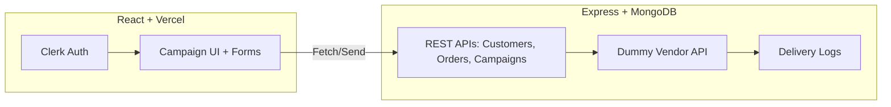

# Xeno Mini-CRM – Frontend

This is the **frontend** of the Mini-CRM Platform built for the **Xeno SDE Internship Assignment – 2025**.
It enables customer segmentation, campaign creation, and AI-powered insights with a clean, modern UI.

🌐 **Live Demo (Vercel):** \[https://xeno-mini-crm-frontend-rust.vercel.app/]

---

## 🚀 Features

* **Authentication** – Secure login with Clerk (Google OAuth).
* **Customer & Order Ingestion** – Upload via CSV or add single entries.
* **Dynamic Campaign Builder** – Create audience segments using flexible rules (spend, visits, activity, etc.).
* **Audience Preview** – Estimate campaign reach before saving.
* **Campaign History** – View past campaigns, delivery stats, and statuses.
* **AI Integration** –

  * Convert natural language to segment rules.
  * Generate campaign message suggestions.

---

## 🛠 Tech Stack

* **Framework:** React + Vite
* **Styling:** Tailwind CSS + shadcn/ui + lucide-react icons
* **Auth:** Clerk (Google OAuth 2.0)
* **Deployment:** Vercel
* **APIs:** Express.js + MongoDB backend (see `/backend` repo)

---

## 📦 Folder Structure

```
frontend/
├── node_modules/
├── public/
├── src/
│   ├── components/
│   │   ├── button.jsx
│   │   ├── CampaignHistory.jsx
│   │   ├── Footer.jsx
│   │   ├── Navbar.jsx
│   │   └── StatCard.jsx
│   ├── pages/
│   │   ├── CampaignUI.jsx
│   │   ├── CustomerIngestPage.jsx
│   │   ├── Dashboard.jsx
│   │   └── Landing_Page.jsx
│   ├── utils/
│   │   ├── apifetch.js
│   │   └── getauthheaders.js
│   ├── App.css
│   ├── App.jsx
│   ├── index.css
│   └── main.jsx
├── .env
├── .gitignore
├── eslint.config.js
├── index.html
├── package-lock.json
├── package.json
├── README.md
└── vite.config.js
```

---

## ⚙️ Local Setup

1. Clone the repo and move into the frontend folder:

   ```bash
   git clone https://github.com/your-username/xeno-mini-crm.git
   cd xeno-mini-crm/frontend
   ```

2. Install dependencies:

   ```bash
   npm install
   ```

3. Create a `.env.local` file:

   ```env
   VITE_CLERK_PUBLISHABLE_KEY=your_clerk_key
   VITE_API_BASE=http://localhost:8000/api/v1
   ```

4. Run locally:

   ```bash
   npm run dev
   ```

5. Open in browser:

   ```
   http://localhost:5173
   ```

---

## 🔗 Deployment

This frontend is deployed on **Vercel**.
Every push to the `main` branch auto-deploys a new version.

Steps (if redeploying):

1. Connect repo to Vercel dashboard.
2. Add environment variables in **Vercel → Project Settings → Environment Variables**.
3. Trigger deployment (manual or auto via GitHub).

---

## 📐 Architecture



---

## ⚠️ Known Limitations

* Bulk uploads require properly formatted CSVs (see sample in `/samples`).
* AI features rely on OpenAI API – ensure correct API key is set in backend.
* Campaign delivery is simulated (\~90% SENT / \~10% FAILED).

---

## ✨ Author

Built with ❤️ by **Anmol Singh** for the **Xeno SDE Internship 2025 Assignment**.
